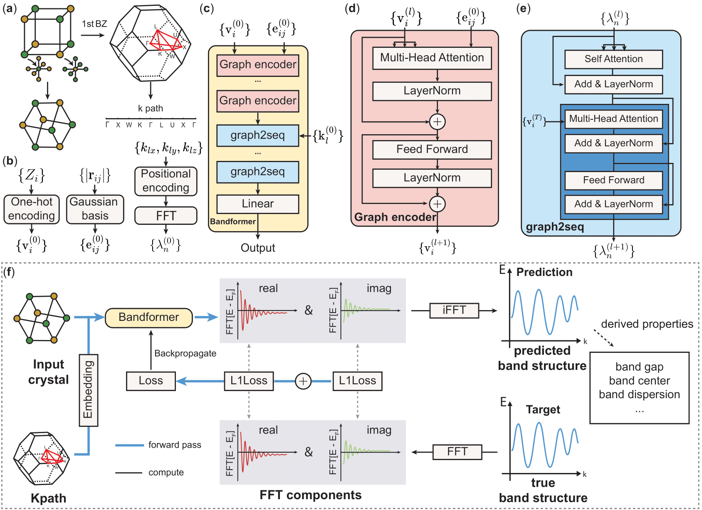

# Bandformer: Graph Transformer Networks for Accurate Band Structure Prediction



This repository contains the official implementation of the paper:

**Graph Transformer Networks for Accurate Band Structure Prediction: An End-to-End Approach**  
*Weiyi Gong, Tao Sun, Hexin Bai, Jeng-Yuan Tsai, Haibin Ling, Qimin Yan*  
[arXiv:2411.16483](https://arxiv.org/abs/2411.16483)

## Abstract

Predicting electronic band structures from crystal structures is crucial for understanding structure-property correlations in materials science. First-principles approaches are accurate but computationally intensive. Here, we introduce a graph Transformer-based end-to-end approach that directly predicts band structures from crystal structures with high accuracy. Our method leverages the continuity of the k-path and treats continuous bands as a sequence. We demonstrate that our model not only provides accurate band structure predictions but also can derive other properties (such as band gap, band center, and band dispersion) with high accuracy.

## Citation

If you find this work useful in your research, please cite our paper:

```bibtex
@misc{gong2024graphtransformernetworksaccurate,
      title={Graph Transformer Networks for Accurate Band Structure Prediction: An End-to-End Approach}, 
      author={Weiyi Gong and Tao Sun and Hexin Bai and Jeng-Yuan Tsai and Haibin Ling and Qimin Yan},
      year={2024},
      eprint={2411.16483},
      archivePrefix={arXiv},
      primaryClass={cond-mat.mtrl-sci},
      url={https://arxiv.org/abs/2411.16483}, 
}
```

## Usage

### Prerequisites

The project relies on the following key packages:
*   [Python](https://www.python.org/) >= 3.11
*   [PyTorch](https://pytorch.org/) == 2.8
*   [PyTorch Geometric](https://pytorch-geometric.readthedocs.io/) == 2.7.0
*   [Pymatgen](https://pymatgen.org/) >= 2025.10.7
*   [ASE](https://wiki.fysik.dtu.dk/ase/) >= 3.26.0
*   [NumPy](https://numpy.org/) >= 2.3.5
*   [WandB](https://wandb.ai/) >= 0.23.0

### Installation

First, clone the repository:

```bash
git clone https://github.com/username/bandformer.git
cd bandformer
```

### Environment Setup

We recommend using [uv](https://github.com/astral-sh/uv) for efficient and reliable dependency management. For detailed documentation, please visit the [official uv website](https://docs.astral.sh/uv/).

#### Option 1: Using uv (Recommended)

1.  **Install uv**

    If `uv` is not already installed, use the standalone installer:

    ```bash
    curl -LsSf https://astral.sh/uv/install.sh | sh
    ```

2.  **Install Dependencies**

    Create the virtual environment and install all dependencies (including PyTorch and PyG) as defined in `pyproject.toml`:

    ```bash
    uv sync
    ```

    Activate the environment:

    ```bash
    source .venv/bin/activate
    ```

#### Option 2: Using Conda or Pip

For users preferring Conda or standard Pip, follow these steps:

1.  **Create and Activate Environment**

    ```bash
    conda create -n bandformer python=3.11
    conda activate bandformer
    ```

2.  **Install Dependencies**

    First, install PyTorch (version 2.8 recommended):

    ```bash
    pip install torch==2.8.0 --index-url https://download.pytorch.org/whl/cu121
    ```
    *(Note: Adjust the CUDA version `cu121` based on your system configuration.)*

    Then, install the remaining dependencies:

    ```bash
    pip install -e .
    ```

    Alternatively, manually install the requirements:

    ```bash
    pip install setuptools pyyaml ase ase-db-backends numpy pymatgen wandb
    pip install torch-geometric==2.7.0 pyg_lib torch_scatter torch_sparse torch_cluster torch_spline_conv -f https://data.pyg.org/whl/torch-2.8.0+cu121.html
    ```

### Data Preparation

#### Details

The raw data was obtained from Materials Project's repository at AWS Open Data Program (information available at [https://docs.materialsproject.org/downloading-data/aws-opendata](https://docs.materialsproject.org/downloading-data/aws-opendata)). We downloaded 705k (1.5 TB) parsed band structures from bucket 'materialsproject-parsed'. The data contains band structures both using uniform mode and symm-line mode. From symm-line mode data, we manually chose non-magnetic materials and cleaned the data by removing outliers. Eventually we obtained around 27k band structures. The data is split by `prepare.py` into 90% for training and 10% for evaluation.

#### Instructions

The model expects the dataset file `nm-6-cleaned-maxlen-30.pt` to be present in the `data/` directory.

1.  **Download Data**: Download the dataset from [Figshare](https://doi.org/10.6084/m9.figshare.30502967) and place the file `nm-6-cleaned-maxlen-30.pt` into the `data/` folder.

2.  **Prepare Splits**: Run the preparation script to generate training and validation splits (`train.pt` and `val.pt`).

    ```bash
    python data/prepare.py
    ```

### Training

The training script `train.py` supports both single-GPU and Distributed Data Parallel (DDP) training. Configuration is handled via `configs/train.yaml`.

#### Configuration

You can modify training hyperparameters in [configs/train.yaml](configs/train.yaml), such as:
*   `batch_size`
*   `learning_rate`
*   `n_layer`, `n_head`, `n_embd` (Model architecture)
*   `wandb_log` (Logging)

#### Single GPU Training

To run training on a single GPU:

```bash
python train.py --config configs/train.yaml
```

You can also override configuration parameters from the command line:

```bash
python train.py --batch_size 32 --compile False
```

#### Distributed Training (DDP)

To run on multiple GPUs (e.g., 4 GPUs on a single node):

```bash
torchrun --standalone --nproc_per_node=4 train.py --config=configs/train.yaml
```

## Acknowledgement

We acknowledge the following resources that were helpful in the development of this project:

*   **Transformer Implementation**: We referred to [PyTorch's official implementation](https://pytorch.org/docs/stable/generated/torch.nn.Transformer.html) and [The Annotated Transformer](https://nlp.seas.harvard.edu/2018/04/03/attention.html).
*   **Open Source Repositories**:
    *   [Xtal2DoS](https://github.com/JunwenBai/Xtal2DoS)
    *   [e3nn](https://github.com/e3nn/e3nn)
    *   [nanoGPT](https://github.com/karpathy/nanoGPT)
